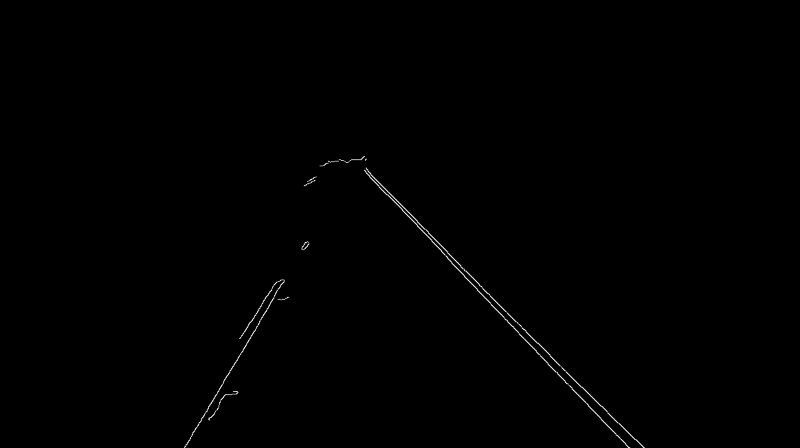
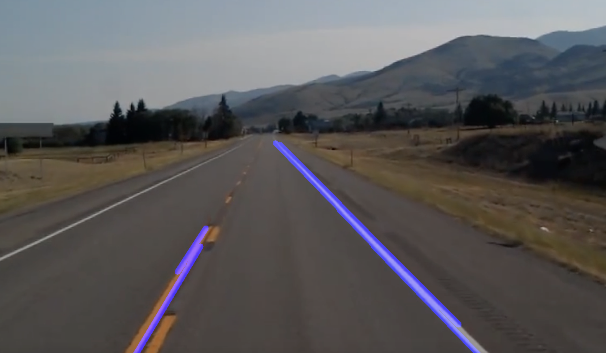

used Gaussian-blur, mask, gradient and image processing on a road image to get lane line co-ordiantes and plot slopes 

region of interest is calculated based on the line path of tack as below

final track intercepted are as:

